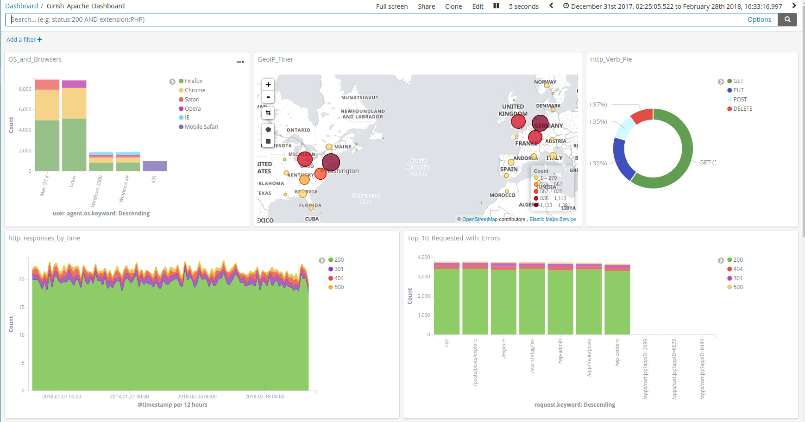
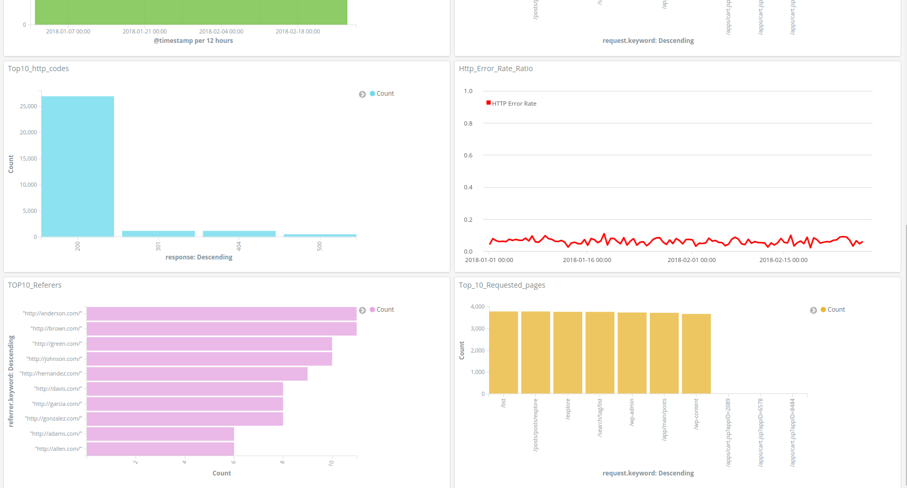

# ELK stack deployer (A Timed Interview Test from 2018 ~7 days)

## This package:
1. Uses docker-compose to deploy a fully working ELK stack
2. Downloads Compressed log files from user defined URL.
3. Comes with Dashboard/settings json file to import into Kibana to visualise apache logs.

## Prerequisites (Instructions for Ubuntu 18.04):
1. docker-ce (install so that use without sudo is available). [docker-install-info]
2. docker-compose (install so that use without sudo is available). [docker-compose-install-info]
3. wget
4. dpkg
5. gunzip

## Usage via scripts in root of archive
1. 00_check_program_reqs.sh: Check prerequisites
2. 01_launch_elk_stack.sh: Download logs & launch ELK stack
3. 02_shutdown_elk_stack.sh: Shutdown
4. export.json: Json file with settings to export into Kibana. [kibana-import-info].
5. To visualise dashboard, go to Kibana dashboard. In the navigation pane, choose Stack Management. Choose Saved Objects. On the search page for saved objects, choose Import. select export.json. Choose Import. Then select the Dashboard I created `Girish_Apache_Dashboard`. [Detailed Instructions](https://aws.amazon.com/blogs/big-data/export-and-import-kibana-dashboards-with-amazon-es/#:~:text=Dashboard%20import&text=the%20following%20steps%3A-,Log%20in%20to%20the%20Kibana%20dashboard.,for%20saved%20objects%2C%20choose%20Import.)

## Dashboard screenshots

## Additional Links
* [docker-compose-install-info](https://www.digitalocean.com/community/tutorials/how-to-install-docker-compose-on-ubuntu-18-04)

* [kibana-import-info](https://aws.amazon.com/blogs/big-data/export-and-import-kibana-dashboards-with-amazon-es/#:~:text=Dashboard%20import&text=the%20following%20steps%3A-,Log%20in%20to%20the%20Kibana%20dashboard.,for%20saved%20objects%2C%20choose%20Import.)
